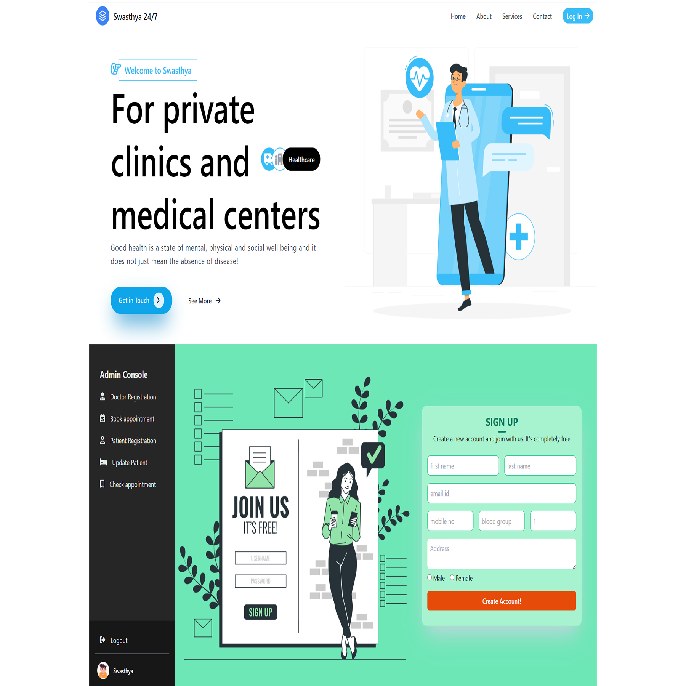
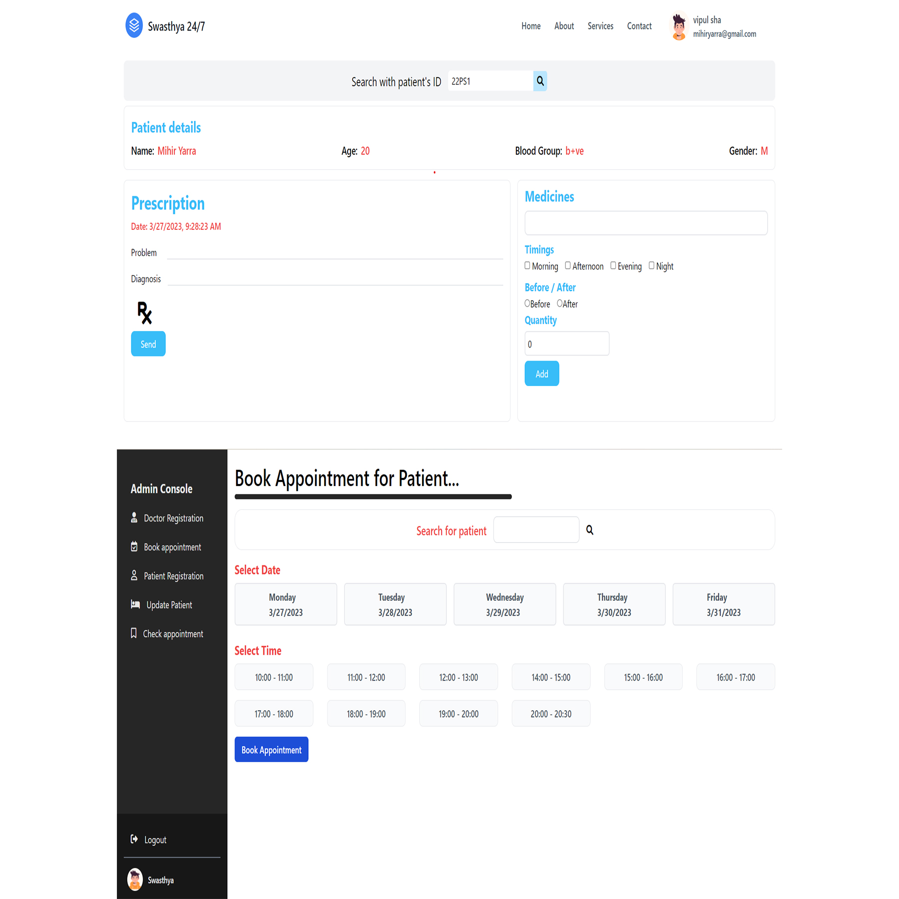
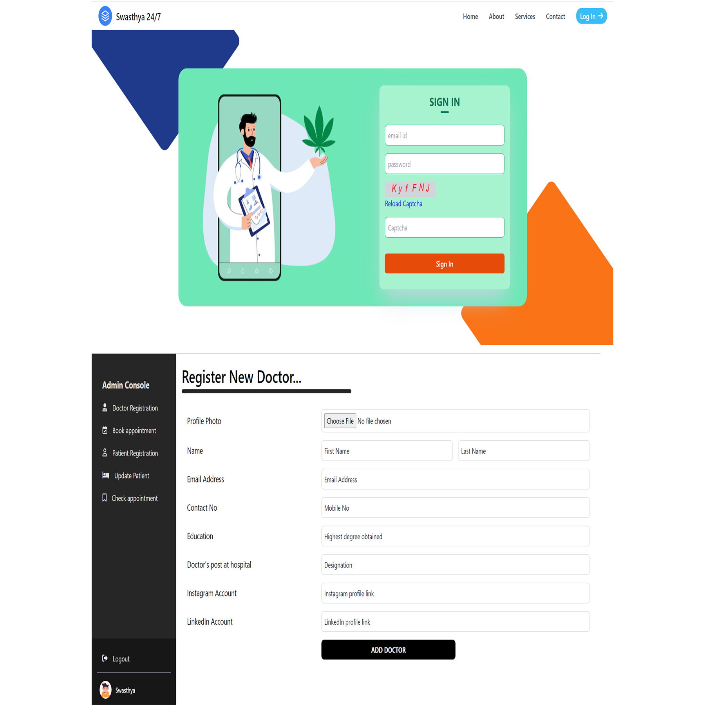

# Swasthya Healthcare Solution
"Swasthya" website is used to refer to new Patients and doctors.Doctor can create a report based on the patient's disease, diagnosis and medicines.

## Features

- <b>Admin</b> - Register new doctors, new patients, book appointments,update details.
- <b>Doctor</b> - create a report, check the appointments.

## Tech Stack

Here we use these technical components :


**Client:** React, React Native, TailwindCSS

**Server:** Node, Express, MongoDB

## Run Locally

Clone the project

```bash
  git clone https://github.com/my1243/swasthya.git

```

## to start the SERVER

Go to the project directory

```bash
  cd verifyIt-swasthya/backend
```

Install dependencies

```bash
  npm install
```

Run the project

```bash
  node Src/app.js
```

Note : Make sure to add .env file for enviorment variables.

## to start the Client Application

Go to the project directory

```bash
  cd verifyIt-swasthya/src/App.js
```

Install dependencies

```bash
  npm install
```

## to start the Client Web ( Admin only )

Go to the project directory

```bash
  cd verifyIt-Hackprints/client_Web
```

Install dependencies

```bash
  npm install
```

Run the project

```bash
  npm start
```

## Screenshots






